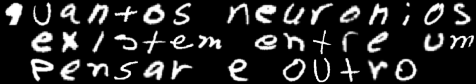

# sistemaNeural_RDDeepX
(mini) biblioteca desenvolvida e aplicada ao desafio "Handwritten Character Recognition"

O desafio foi alinhado ao desenvolvimento de uma (mini) biblioteca para treino de rede neural fortemente conectada. Com esta biblioteca, foi treinada uma rede que, aplicada ao banco de teste balanceado do EMNIST, obteve taxa de acerto de 87% para letras e 96% para dígitos numéricos. A linguagem utilizada é o C++.

### Exemplo

|   Entrada                       |      Saída                                         |
|:-------------------------------:|:--------------------------------------------------:|
||  qu**q**ntos neuron**j**os existem **q**ntre um pensar e outro |
||      0123456789 **2**918273654                         |

_Quase_. Redes convolucionais atingem maior taxa de acerto, mas como essa foi minha primeira abordagem ao tema, optei por estudar e desenvolver um sistema mais simples, de rede fortemente conectada, que é basilar para as redes convolucionais.

As redes treinadas e programas exemplo estão disponíveis na pasta [exemplo](/exemplo).

### Relatórios

O arquivo [relatório.pdf](relatório.pdf) contém uma visão geral que guiou o desenvolvimento, e os detalhes estão no [relatório_técnico.pdf](relatório_técnico.pdf), que inclui as derivações numéricas do algorítmo de backpropagation e explica decisões de design.

### Treino e Teste de Rede Neural

A pasta [treino](/treino) possui programas que demonstram o treino e teste da rede.
